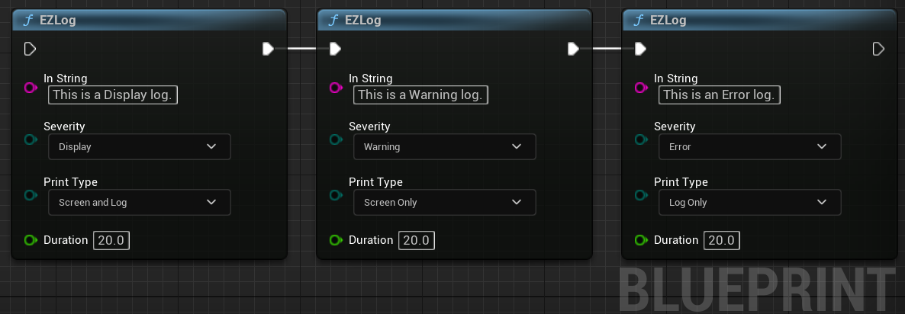
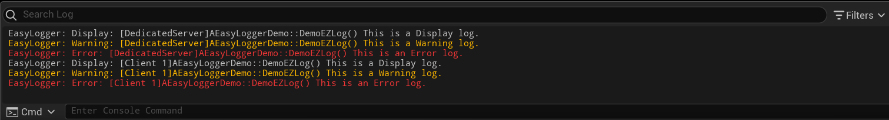
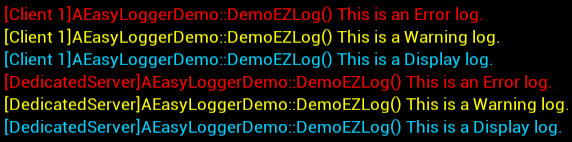

Overview
========

This repository contains an Unreal Engine plugin for logging information to the viewport and/or output log. Logs contain which class and function they originate from, as well as if they are coming from clients or server.


Example Usage
------------

**C++**
```C++
#include "EasyLoggerStatics.h"

void AEasyLoggerDemo::DemoEZLog()
{
	UEasyLoggerStatics::EZLog(this, __FUNCTION__, "This is a Display log.");
	UEasyLoggerStatics::EZLog(this, __FUNCTION__, "This is a Warning log.", EEZLogSeverity::Warning);
	UEasyLoggerStatics::EZLog(this, __FUNCTION__, "This is an Error log.", EEZLogSeverity::Error);
}
```

**Blueprint**


**Output Log**


**Viewport Output**  



Setup Logging in Shipping Builds
--------------------------

EasyLogger may be used to produce log files while used in shipping builds. Logging this way from BP results in the loss of the function name prefix.
In order to setup your project to log in shipping builds, modify your project Target.cs file to include one of the following configurations.

**Binary Engine (downloaded from the Epic Games Launcher)**
```C++
public MyGameTarget(TargetInfo Target) : base(Target)
{
	Type = TargetType.Game;
	DefaultBuildSettings = BuildSettingsVersion.V2;
	IncludeOrderVersion = EngineIncludeOrderVersion.Latest;

	ExtraModuleNames.AddRange( new string[] { "MyGame" } );
		
	// Add the below
		
	// Setup shipping logging in binary engine builds
	bOverrideBuildEnvironment = true;
		
	// Shipping log files will be produced in %localappdata%/<ProjectName>/Saved/Logs
	bUseLoggingInShipping = true;
}
```

**Source Engine (compiled from source)**
```C++
public MyGameTarget(TargetInfo Target) : base(Target)
{
	Type = TargetType.Game;
	DefaultBuildSettings = BuildSettingsVersion.V2;
	IncludeOrderVersion = EngineIncludeOrderVersion.Latest;

	ExtraModuleNames.AddRange( new string[] { "MyGame" } );
		
	// Add the below
		
	// Setup shipping logging in source engine builds
	BuildEnvironment = TargetBuildEnvironment.Unique;
		
	// Shipping log files will be produced in %localappdata%/<ProjectName>/Saved/Logs
	bUseLoggingInShipping = true;
}
```